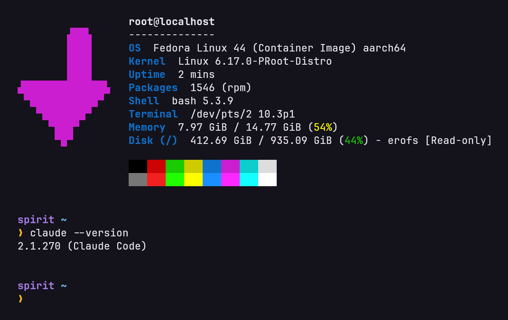
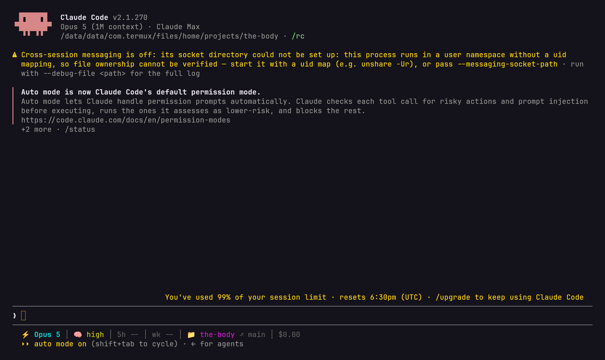
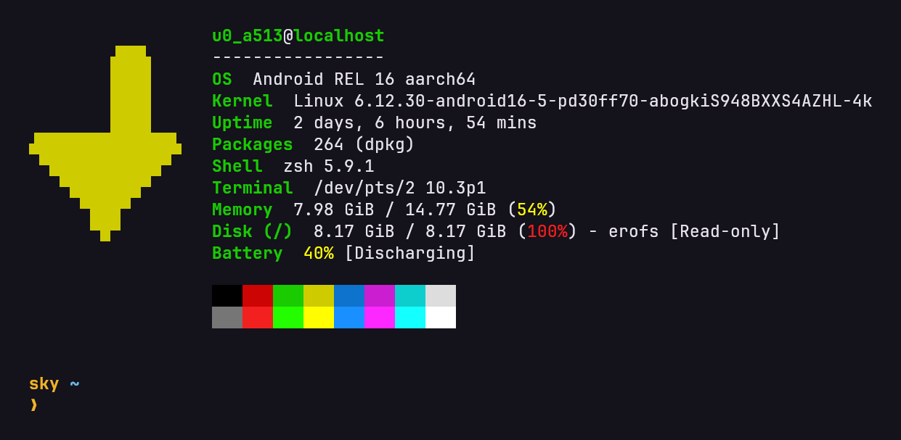

# spirit

A real Linux on my phone. Fedora 44 on a Galaxy S26 Ultra, on top of Android. No root, bootloader still locked, phone is completely stock. I don't really use it myself, I built it so an AI agent would have a proper Linux to sit in.

  

Setup is in [docs/setup.md](docs/setup.md), about 20 minutes, and I ran every step of it on this phone. The AI side is in [docs/ai-layer.md](docs/ai-layer.md), including the parts that broke. There are two scripts in [scripts/](scripts), one that does the inside-the-container setup for you and one little bridge thing the agent needs. The app that gives the agent hands is its own repo, [the-body](https://github.com/beqa-beridze/the-body).

Start here, then go there.

## What it actually is

Termux is a Linux userland packaged as a normal Android app. Terminal, package manager, ssh, tmux, compilers, all of it inside one app's sandbox. It's genuinely good. But it's built against Android's libc instead of glibc, so it's its own thing and plenty of normal Linux binaries just won't run on it.

Then proot-distro takes a real Fedora root filesystem, drops it in a folder, and runs programs out of that folder while telling them the folder is `/`. A fake root. Fedora has no idea, it sees a normal `/` and gets on with it.

That fake root is the whole trick and it's also why it's slow. Every time a program asks the kernel for something, open this file, or list a directory, whatever it is, proot catches the request before the kernel sees it and rewrites the paths so `/etc/passwd` really means `<that folder>/etc/passwd`. It does that with ptrace, which is the same thing debuggers use to stop a program at every step. So the whole OS gets translated live, syscall by syscall. Or whatever the right term for it is.

I timed the same Python script in Termux and then inside the proot:

| | native | inside the proot |
|---|---|---|
| 300k bignum additions (pure CPU) | 2553 ms | 2558 ms |
| 3000 files created, stat'd, deleted | 303 ms | 2334 ms |

Arithmetic is free, because it never asks the kernel anything. Touch files and you pay about 8x. So `npm install` and compiling and `git status` on a big repo are all painful. A model that spends most of its time waiting on an API doesn't care.

It lies about the kernel too. `uname -r` says `6.17.0-PRoot-Distro` and the phone is really on 6.12, which proot fakes so software that checks for an old kernel doesn't refuse to start.

You're root in there but it's proot pretending. You can't touch the Android system and nothing gets loaded into the kernel. systemd is installed but it can't run, because it isn't PID 1 and never will be, so `systemctl` just tells you the system wasn't booted with it. Nothing starts on its own. You start everything yourself.

Other than that it's a full Fedora. `dnf` works. Mine has about 1600 packages in it now, a JDK, gcc, node, python, tmux, llama.cpp that I compiled on the phone, a whole Android build toolchain. It's a Linux box in my pocket with better specs than the ThinkPad I built [Bero-OS](https://github.com/beqa-beridze/Bero-OS) on, which is a bit annoying actually.

## Why it's for an agent and not for me

Because using it as a human on a phone is a pain in the ass. The on-screen keyboard is wrong for a terminal and the screen is tiny, and Samsung kills Termux in the background whenever it feels like it. Battery goes fast too. I end up sshing into it from my laptop, which kind of defeats the point of the thing being in my pocket.

So I turned it around. It isn't usable for a human on a phone, so the best thing to run on it is a CLI AI tool. I use Claude Code. Inside the proot it gets a real shell and real files and the phone's network. With [the-body](https://github.com/beqa-beridze/the-body) it gets the phone itself, so it can read the screen, tap things, answer a notification, and ping me with a yes or no question when it's stuck.

  

One tap on a home screen widget opens Claude Code inside the Fedora. Or it just runs on a timer with nobody touching it at all. For a couple of months that ran a companion agent that woke up every fifteen minutes and dealt with whatever had happened. That one isn't public and won't be, it knows way too much about my life, but how it was wired up is in [docs/ai-layer.md](docs/ai-layer.md).

## The AI part

I built a lot of this with AI help. The app too, and these docs. Claude Code did most of the typing and all the boring repetitive bits, I did the reading and the deciding, and honestly most of my actual time went on arguing with Samsung.

So it goes up here and not in a footnote at the bottom. The whole idea is a machine that an agent and I run together, so pretending otherwise would be strange.

Same thing as Bero-OS but from the other end. With Bero-OS I'm building the machine from source so I actually understand what I'm handing over. This one was already in my pocket, it just needed hands.

## The layers

| Layer | What it is |
|---|---|
| Android 16, One UI 8.5 | the phone, untouched |
| Termux 0.118 | Linux userland as an app. Its own packages, ssh on 8022, tmux, and the Boot / Widget / API add-ons |
| proot-distro 5.4 + proot 5.1 | pulls a distro image and runs it under the fake root |
| Fedora 44 aarch64 | the actual OS. zsh, starship, dnf, node, JDK, python, the lot |
| Claude Code 2.1 | the agent, installed normally, run with permissions off |
| [the-body](https://github.com/beqa-beridze/the-body) | Android app. Eyes, hands and a mouth over a loopback HTTP API |

  

I call the Fedora layer spirit and the app the body. There was a sky layer too which was just the Termux prompt. The names are Avatar, I'm not being deep about it.

## What's wrong with it

- Slow as hell in the way measured up there. Fine for an agent that spends most of its time waiting on the network. Don't expect a laptop.
- Samsung kills things. Android's memory killer eats Termux's sshd every one to four days even with battery optimisation off, so anything that has to stay up needs something else watching it.
- Boot scripts don't run at boot. Android only tells apps the phone booted after the first unlock, so if it reboots at 3am nothing happens until I pick it up.
- The adb-over-loopback connection dies on every reboot and no app can turn it back on. Anything built on adb is fragile, which is half the reason the body app exists.
- No real root, no systemd, no services.
- I tested all of this on one phone. Other Androids hide the Samsung switches somewhere else, or don't have them.

MIT. The app and the writing are mine, the rest obviously isn't.
